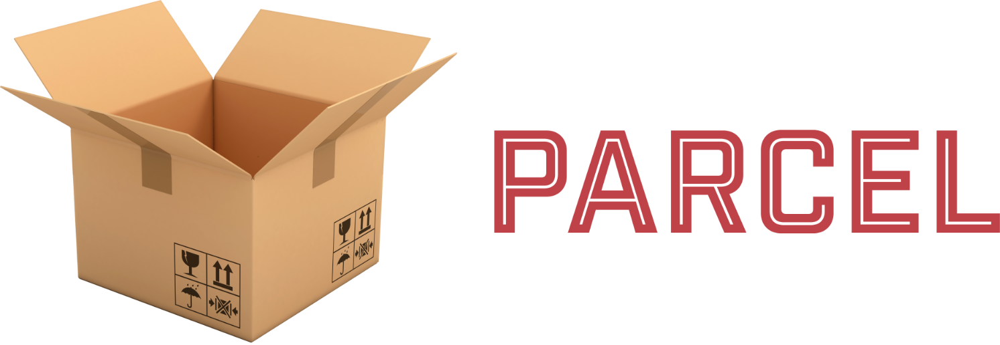

<h1 align="center">Hi 👋, I'm Yixuan</h1>

<h3 align="center">A junior frontend developer</h3>

- 🇫🇷 I completed a frontend [online course](https://openclassrooms.com/fr/) from September 2021 to November 2022 in France.

- 🌱 I’m currently learning **Node.js, MongoDB**

- 👨‍💻 All of my projects are available at [my portfolio](https://portfolio-yixuan-wang.vercel.app/)

- 🚀 You can also find my Challenges on [Frontend mentor](https://www.frontendmentor.io/profile/yxwangOCR)

- 📄 Know about my experiences at [LinkedIn](www.linkedin.com/in/yixuanwang-dev)

<h3 align="left">Languages:</h3>

 
   
   
   

<h3 align="left">Frameworks & Libraries:</h3>

 
   
   
  
   
  
  
   
   

<h3 align="left">UI/UX Design:</h3>

 
  
  

<h3 align="left">Build Tools:</h3>

 

 

  

  
